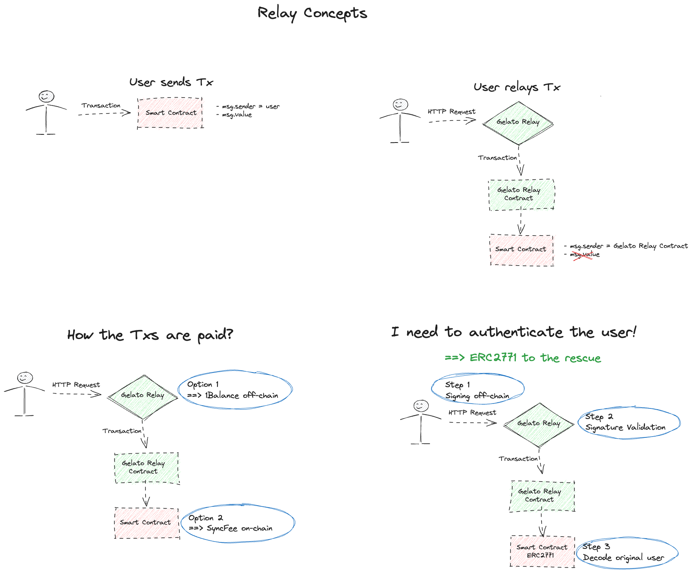

# How To #5-6-7-8 on Gelato: Relay Methods

## Introduction to Gelato Relay

Using Gelato Relay, we relay your user's transactions on-chain, enabling secure gasless transactions for an ultra smooth UX for your app. This allows for a variety of new web3 experiences, as the user can now pay by only signing a message, or their transaction costs can be sponsored by the developer. As long as the gas costs are covered in one of the multiple payment methods that Gelato supports, we handle the rest reliably, quickly and securely.

[](https://youtu.be/4g6k4bwjfno)

 


The Gelato Relay SDK provides developers with various methods to interact with Gelato's infrastructure. Below are four essential SDK methods:

### ERC2771 MEthods

#### sponsoredCallERC2771

This method executes a function on behalf of the user, allowing them to submit tasks without holding any ETH in their wallets. It utilizes the EIP-2771 standard for meta transactions, enabling gasless transactions for users, and leverages Gelato 1balance for payment.

[](https://youtu.be/P6LlzSzta1Q)

#### callWithSyncFeeERC2771

Combining the features of `callWithSyncFee` and EIP-2771 meta transactions, this method provides gasless transaction capabilities. The target contract assumes responsibility for transferring the fee to Gelato's fee collector during transaction execution.

[](https://youtu.be/v6cHdGTzf0c)

### NON ERC2771 MEthods

[](https://youtu.be/shqLPDerunY)

#### sponsoredCall

Similar to `sponsoredCallERC2771`, this method enables gasless transactions using a different approach, suitable for environments where you have your own authentication logic. Also making use of Gelato 1balance.

#### callWithSyncFee

When using callWithSyncFee relay method the target contract assumes responsibility for transferring the fee to Gelato's fee collector during transaction execution.


## Backend/Node examples

> [!IMPORTANT]  
> "@gelatonetwork/relay-sdk": "^5.5.0",

### Environment Setup

Please copy `.env.example` to `.env` and add the following variables:

- GELATO_RELAY_API_KEY
- PRIVATE_KEY
- ALCHEMY_ID

### sponsoredCallERC2771

```
yarn testSponsoredCallERC2771
```

code can be found [here](scripts/testSponsoredCallERC2771.ts) and here the [docs](https://docs.gelato.network/developer-services/relay/erc-2771-recommended/sponsoredcallerc2771)

### sponsoredCall

```
yarn testSponsoredCall
```

code can be found [here](scripts/testSponsoredCall.ts) and here the [docs](https://docs.gelato.network/developer-services/relay/non-erc-2771/sponsoredcall)

### callWithSyncFee

```
yarn testCallWithSyncFee
```

code can be found [here](scripts/testCallWithSyncFee.ts) and here the [docs](https://docs.gelato.network/developer-services/relay/non-erc-2771/callwithsyncfee)

### callWithSyncFeeERC2771

```
yarn testCallWithSyncFeeERC2771
```

code can be found [here](scripts/testCallWithSyncFeeERC2771.ts) and here the [docs](https://docs.gelato.network/developer-services/relay/erc-2771-recommended/callwithsyncfeeerc2771)

### concurrentSponsoredCallERC2771

```
yarn testConcurrentSponsoredCallERC2771
```

code can be found [here](scripts/testConcurrentSponsoredCallERC2771.ts) and here the [docs](https://docs.gelato.network/developer-services/relay/erc-2771-recommended/sponsoredcallerc2771#parameters-for-concurrent-requests)

### getSignatureDataERC2771 with sponsoredCallERC2771WithSignature

```
yarn testSponsoredCallERC2771WithSignature
```

code can be found [here](scripts/testSponsoredCallERC2771WithSignature.ts) and here the [docs](https://docs.gelato.network/developer-services/relay/erc-2771-recommended/sponsoredcallerc2771#getdatatosignerc2771)

### getDataToSignERC2771 with sponsoredCallERC2771WithSignature

```
yarn testSponsoredGetDataToSignERC2771
```

code can be found [here](scripts/testSponsoredGetDataToSignERC2771.ts) and here the [docs](https://docs.gelato.network/developer-services/relay/erc-2771-recommended/sponsoredcallerc2771#getdatatosignerc2771)

### getSignatureDataERC2771 with callWithSyncFeeERC2771WithSignature

```
yarn testCallWithSyncFeeERC2771WithSignature
```

code can be found [here](scripts/testCallWithSyncFeeERC2771WithSignature.ts) and here the [docs](https://docs.gelato.network/developer-services/relay/erc-2771-recommended/callwithsyncfeeerc2771#getsignaturedataerc2771)

### getDataToSignERC2771 with callWithSyncFeeERC2771WithSignature

```
yarn testCallWithSyncFeeGetDataToSignERC2771
```

code can be found [here](scripts/testCallWithSyncFeeGetDataToSignERC2771.ts) and here the [docs]( and here the [docs](https://docs.gelato.network/developer-services/relay/erc-2771-recommended/callwithsyncfeeerc2771#getsignaturedataerc2771)
)

## Tracking your Relay Request

### WebSocket Subscription

Docs can be found [here](https://docs.gelato.network/developer-services/relay/tracking-your-relay-request#websocket-subscriptions)

[Relay-sdk Implementation](src/components/App/index.tsx#L121)

```typescript
relay.onTaskStatusUpdate((taskStatus: TransactionStatusResponse) => {
  console.log("Task status update", taskStatus);
  fetchStatusSocket(taskStatus, setMessage, setLoading);
});
```

[Websocket API](src/components/App/index.tsx#L161)

```typescript
const relayStatusWs = new WebSocket("wss://api.gelato.digital/tasks/ws/status");
relayStatusWs.onopen = (event) => {
  relayStatusWs.send(
    JSON.stringify({
      action: "subscribe" as string,
      taskId: response.taskId,
    }),
  );
  relayStatusWs.onmessage = (event) => {
    fetchStatusSocket(JSON.parse(event.data).payload, setMessage, setLoading);
  };
};
```

### Polling for Updates

Docs can be found [here](https://docs.gelato.network/developer-services/relay/tracking-your-relay-request#polling-for-updates)

[code](src/components/App/task.ts#L27)

```typescript
let status = await relay.getTaskStatus(taskIdToQuery);`
```

### Status

Docs can be found [here](https://docs.gelato.network/developer-services/relay/tracking-your-relay-request#task-status-response)

```typescript
let details = {
  txHash: status?.transactionHash || undefined,
  chainId: status?.chainId?.toString() || undefined,
  blockNumber: status?.blockNumber?.toString() || undefined,
  executionDate: status?.executionDate || undefined,
  creationnDate: status?.creationDate || undefined,
  taskState: (status?.taskState as TaskState) || undefined,
};
let body = ``;
let header = ``;

let txHash = details.txHash;

switch (details.taskState!) {
  case TaskState.WaitingForConfirmation:
    header = `Transaction Relayed`;
    body = `Waiting for Confirmation`;
    break;
  case TaskState.Pending:
    header = `Transaction Relayed`;
    body = `Pending Status`;

    break;
  case TaskState.CheckPending:
    header = `Transaction Relayed`;
    body = `Simulating Transaction`;

    break;
  case TaskState.ExecPending:
    header = `Transaction Relayed`;
    body = `Pending Execution`;
    break;
  case TaskState.ExecSuccess:
    header = `Transaction Executed`;
    body = `Waiting to refresh...`;

    destroyFetchTask.next();
    setTimeout(() => {
      console.log("finish");
      setLoading(false);
    }, 2000);

    break;
  case TaskState.Cancelled:
    header = `Canceled`;
    body = `TxHash: ${details.txHash}`;
    destroyFetchTask.next();
    break;
  case TaskState.ExecReverted:
    header = `Reverted`;
    body = `TxHash: ${details.txHash}`;
    destroyFetchTask.next();
    break;
  case TaskState.NotFound:
    header = `Not Found`;
    body = `TxHash: ${details.txHash}`;
    destroyFetchTask.next();
    break;
  case TaskState.Blacklisted:
    header = `BlackListed`;
    body = `TxHash: ${details.txHash}`;
    destroyFetchTask.next();
    break;
  default:
    break;
}
```

## Gelato Relay Contracts on Arbitrum Blueberry

| Contract Name              | Blueberry GelatoScout Link                                                                            |
| -------------------------- | ----------------------------------------------------------------------------------------------------- |
| CounterFeeCollector        | [Link](https://arb-blueberry.gelatoscout.com/address/0xFb49001366fC0b23B4892909426bd3796958b6D4#code) |
| CounterFeeCollectorERC2771 | [Link](https://arb-blueberry.gelatoscout.com/address/0xBa533674443E017828249eE78a5eCc4b71faC579#code) |
| CounterRelayContext        | [Link](https://arb-blueberry.gelatoscout.com/address/0x0c3E7A7B6D1e0f26e87CE3BFA19616c8062Db3bB#code) |
| CounterRelayContextERC2771 | [Link](https://arb-blueberry.gelatoscout.com/address/0x05E1D00A790a2dBDD4757270ddec5198313d4759#code) |
| OneBalanceCounterERC2771   | [Link](https://arb-blueberry.gelatoscout.com/address/0x5041c60C75633F29DEb2AED79cB0A9ed79202415)      |
| OneBalanceSimpleCounter    | [Link](https://arb-blueberry.gelatoscout.com/address/0x04914ED9098f5447753cde4bbbBB0e07879f9689#code) |
